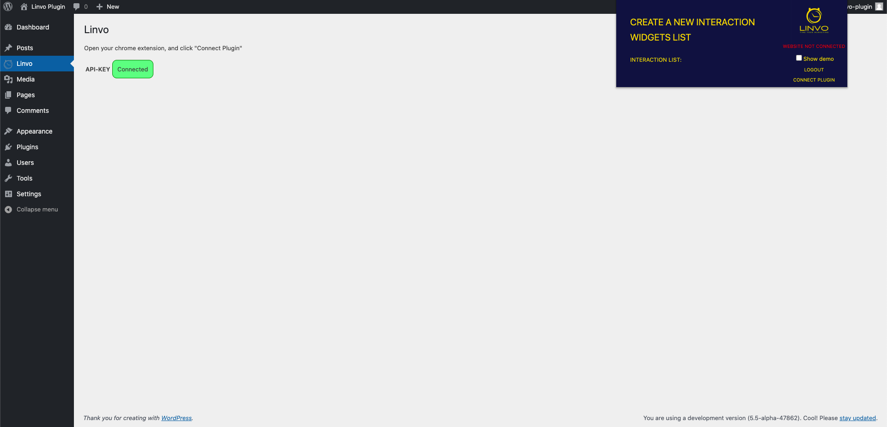

# Linvo / WordPress

# Compatibility

Requires PHP 5.6 or higher.

# Usage

Installing this plugin provides a new Linvo settings page to connect your chrome extension.

NB: This plugin injects a Javascript snippet on your website frontend.
